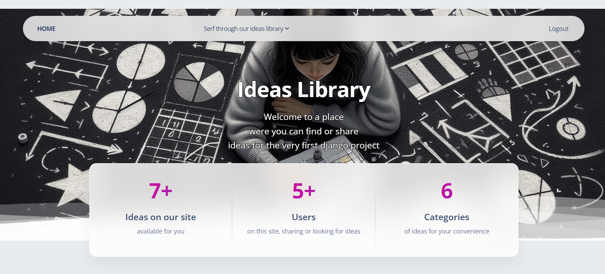
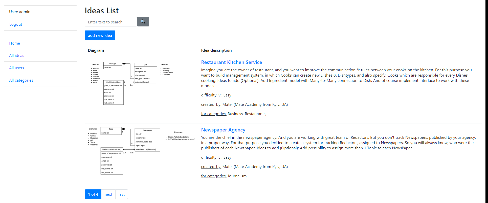

# Ideas-library

Project for storing and managing ideas for students' first portfolio Django project.

## Here you can try it:
[Ideas-library deployed to Render]()

## Installation

Python3 must be already installed

```shell
git clone https://github.com/Alexandr-Politov/ideas-library
cd ideas-library
python -m venv .venv
venv/Scripts/activate
pip install -r requirements.txt
python manage.py runserver
```

## Demos:


